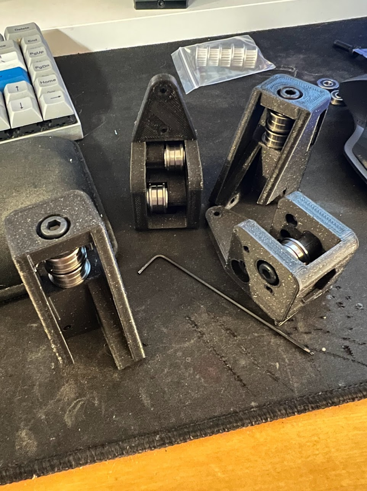

# Rook

This is my fork of the GitHub repo for the [Rook](https://github.com/rolohaun/Rook), a mostly 3D printed CoreXY 3D printer designed
by rolohuan. 


Please see his repo for offical build files and other information. I will be using this repository to
log my build of the printer and store any additional / useful files so that they
can be discovered by others who might want to build this printer.

## Part ordering

Went through the Rook [BOM](https://docs.google.com/spreadsheets/d/1oHDEvndkkvPFOBis4atrHRHK_DMTvttFUFWDg2He6To/edit#gid=0) and
ordered everything specified pretty much using all the provided AliExpress links. 

After I made my order I and looking at the CAD files more closely I realized there was no
hardware specified for attaching the Z axis lead screws to the stepper motors. So I
ended up ordering [this flexible couplings from amazon](https://www.amazon.com/AFUNTA-Flexible-Couplings-Compatible-Machines/dp/B07JL1QYLS/ref=sr_1_4?crid=4MQ82V5BYPGQ&keywords=flexible+couplings+5mm+to+8mm&qid=1670003750&s=industrial&sprefix=Flexible+Couplings+%2Cindustrial%2C145&sr=1-4).
In the future I'm guessing equivalent AliExpress couplings will be added to the BOM.

## Software

### Klipper

#### Raspberry Pi

The Rpi hosts the Klipper web interface and API.
I am planning on using Klipper running on a RPi Zero V2. I followed the installation
guide [provided by Rolohaun](https://www.youtube.com/watch?v=OmBIHB9TFgc&t=314s)
pretty much to the letter and got my MainSail interface running without
a problem

#### Klipper and MainSail installation

Follow [part II of Rolohuan's Klipper installation guide](https://www.youtube.com/watch?v=-SYqTW7wJTo). The firmware build will be specific to the mainboard that you have selected. I have decided to
use the SKR E3 V3 because this is the board used by Rolohaun in his build. 

#### Local acccess point

Part of the appeal of the Rook to me is its small size which allows it to be extremely portable.
One challenge I anticipate of bringing this thing around to new places is that
there is no physical interface for controling the machine; everything is depedent on being
able to access the Klipper Mainsail interface. This means that the machine needs to be
connected to wifi so I can use a labtop on the same network 
or other device to access the Mainsail interface. This would be problematic in locations
where there is poor or no access to a local network. 

To get around this I am using a Raspberry Pi Pico W as a local access point. Following
[this guide](https://www.recantha.co.uk/blog/?p=21398) from Michael Horne I got my
Pico hosting a local wifi network. Then when I need to connect to the Mainsail interface
and / or work on the Raspberry Pi Zero running Klipper for the Rook I connect
to this local network from my labtop. 

Code I am using for the access point is below.

```python
import socket
import network
from machine import Pin
import time

ssid = "YOUR SSID"
password = "YOUR PASSWORD"
led = Pin("LED", Pin.OUT)

ap = network.WLAN(network.AP_IF)
ap.config(essid=ssid, password=password) 
ap.active(True)

print("Access point active")
print(ap.ifconfig())

while True:
    if ap.active() == True:
        led.on()
    else:
        led.off()
        
    time.sleep(0.1)
```

I then setup my RPi Zero that is actually running klipper to connect to this network when it boots up.
You can use [this guide](https://www.tomshardware.com/reviews/raspberry-pi-headless-setup-how-to,6028.html) to
configure headlesss SSH access.

- TODO: Create mount for Pico that attaches to printer frame and find a 5V pin
on the mainboard that can be used to power the Pico.


### Putting things together

First I started by printed out the main components of the frame using Fusion Filaments PLA Pro +.
The Rook is very sensitive to warped parts so I set the bed temp extra high, used a brim
when printing large frame parts and printed the first layer very slow and very hot.


With the main frame parts finished I tested the
fit of the linear rods and made sure the delrin
bearings were sliding smoothly along them.


Next I started fitting the rest of the frame and
bed together as well as setting the M3 heat
set inserts using my soldering iron. Everything
went together pretty easily, just make sure all
parts are oriented correctly. I assembled things
backwards at some point. It helps to have the CAD
model open when first putting the frame together
to keep yourself on track as the frame is pretty
symmetrical. 


I later ended up replacing the bed shown in this
image with the two bearing bedframe that can
be downloaded from Rolohaun's Rook repo. I
found that this bed really does help to reduce
binding on the Z axis. The Rook seems to be very
sensitive to the linear rods not being perfectly
square. The degree of squareness required for a
smooth four bearing set up seems to be difficult
to achieve with 3D printed parts. 

I also lubricated all my linear rods with
Superlube grease by just placing some onto
the rails, moving the rail carriage through the grease
and wiping up the excess. This seemed to work well enough.


Next I printed and assembled the idler towers.
These were a bit tricky to fit everything together.
It helped to sand down the inside area where the washers make contact with the printed plastic with a file. I also used the M5 bolt as a guide to kind of pile the bearings and washers on. As I added more I would screw in the bolt to hold everything in place.



With these parts together I then started working on the hot end assembly and the belting. 


I found this image of a general coreXY belting diagram to be very helpful.


